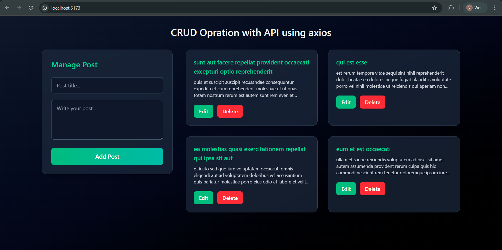

# 📌 React CRUD App using Axios + Tailwind CSS

## 🚀 Project Overview

This project is a **React CRUD application** that performs Create, Read, Update, and Delete operations using React hooks and Axios for API calls. The UI is built using Tailwind CSS with a modern dashboard layout.

Users can:

- View posts from API
- Add new posts
- Edit existing posts
- Delete posts
- See inline validation errors

---

## 📸 UI Preview

Below is the main dashboard interface of the React CRUD application.

  

---

## 🧰 Tech Stack

- React JS
- Axios
- Tailwind CSS
- JSONPlaceholder API

---

## 📂 Features

✔ Fetch posts from API
✔ Responsive card layout
✔ Add new posts
✔ Edit posts
✔ Delete posts
✔ Inline form validation
✔ Dashboard layout (form left, posts right)
✔ Modern Tailwind UI

---

## ⚙️ Installation

### 1. Clone the repository

git clone <your-repository-link>

### 2. Go to project folder

cd your-project-name

### 3. Install dependencies

npm install

### 4. Start development server

npm run dev

App runs at:
http://localhost:5173

---

## 🌐 API Used

https://jsonplaceholder.typicode.com/posts

---

## 🧠 Learning Outcomes

- How to integrate APIs in React
- Using Axios for HTTP requests
- Managing state with hooks
- Handling forms and validation
- Building responsive layouts with Tailwind CSS

---

## ✨ Future Improvements

- Toast notifications
- Loading spinner
- Modal edit popup
- Pagination
- Search feature
