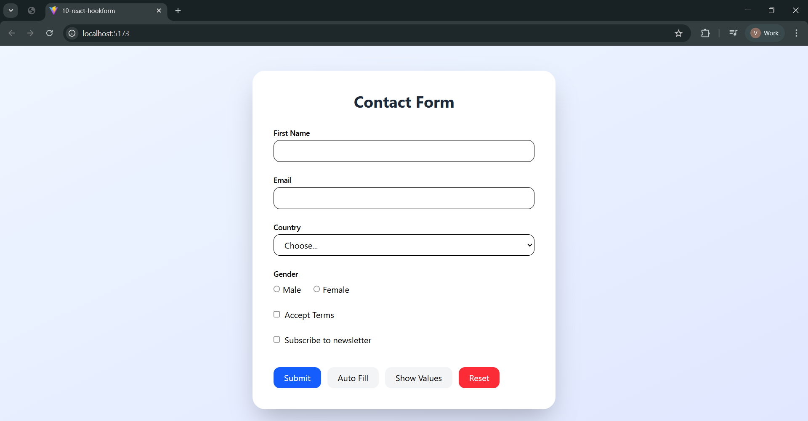

# 📄 React Hook Form + Tailwind + Zod Form Example

A modern responsive form built using **React Hook Form**, **Zod validation**, **Tailwind CSS**, and **Vite**.
This project demonstrates validation schemas, conditional fields, form state handling, and programmatic control of form values.

---

## 📸 UI Preview

Below is the main interface of the form:

<p align="center">
  
</p>

---

## 🚀 Features

- ✅ React Hook Form integration
- ✅ Zod schema-based validation
- ✅ Tailwind CSS modern UI
- ✅ Live validation (`mode: onChange`)
- ✅ Conditional fields using `useWatch`
- ✅ Autofill using `setValue`
- ✅ Read values using `getValues`
- ✅ Reset form using `reset`
- ✅ Loading state with `isSubmitting`
- ✅ Dirty form detection with `isDirty`
- ✅ Responsive card layout

---

## 🧠 Concepts Covered

| Hook / Feature     | Purpose                                             |
| ------------------ | --------------------------------------------------- |
| `useForm()`        | Creates and manages the form instance               |
| `register`         | Connects inputs to React Hook Form                  |
| `handleSubmit`     | Handles validation before submit                    |
| `useWatch`         | Watches field value without re-rendering whole form |
| `setValue`         | Programmatically update field values                |
| `getValues`        | Retrieve current form values                        |
| `reset`            | Reset form to default values                        |
| `formState.errors` | Access validation errors                            |
| `isSubmitting`     | Detect submission loading state                     |
| `isDirty`          | Detect if form was modified                         |
| `Zod Schema`       | Centralized validation rules                        |

---

## 📋 Example Flow

1. User enters name & email
2. Selects country and gender
3. Accepts terms
4. If user subscribes → extra field appears
5. Zod validates inputs in real-time
6. Submit simulates an API request

---

## 🛠️ Tech Stack

- React
- Vite
- React Hook Form
- Zod + RHF Resolver
- Tailwind CSS

---

## ▶️ Run Locally

```bash
npm install
npm run dev
```

Open in browser:

```
http://localhost:5173
```

---

## 📂 Project Structure

```
src/
 ├─ App.jsx
 ├─ schema/
 │   └─ formSchema.js
 ├─ assets/
 │   └─ ui.png
 ├─ main.jsx
 └─ index.css
```

---

## 🎯 Learning Outcome

This project helps you understand:

- How real-world forms are built in React
- How to centralize validation using Zod
- How to optimize performance using React Hook Form
- How to design clean UI using Tailwind
- How to implement conditional form logic

---
